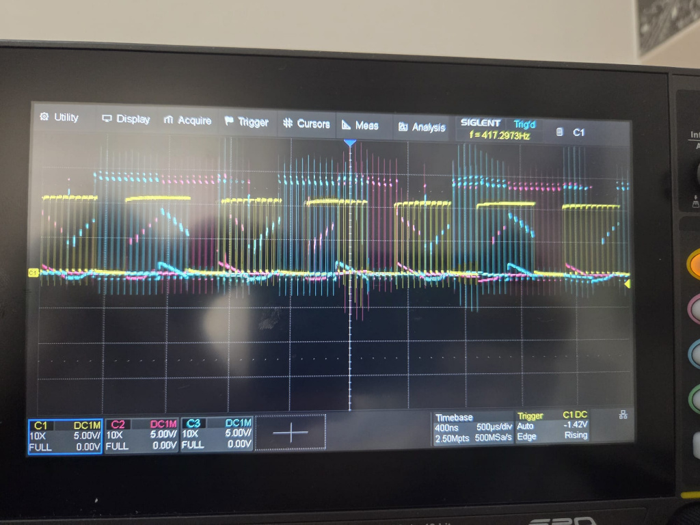
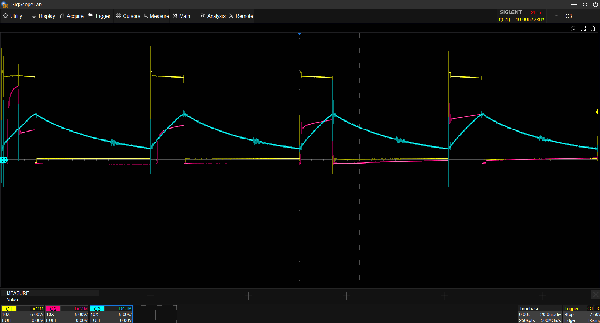
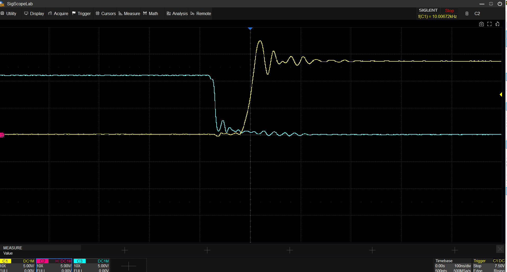
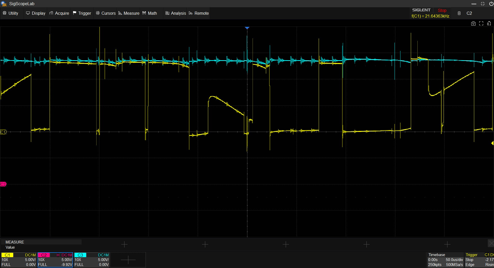
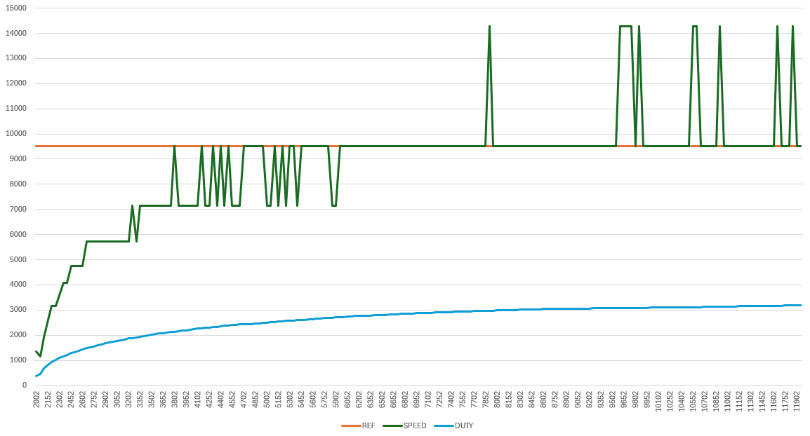

# Hardware Verification and Oscilloscope Measurements

This directory contains the raw hardware validation data for the v1.0 Sensorless BLDC controller. Measurements were taken using a 4-channel Siglent SDS814X oscilloscope.

### 1. 3-Phase Commutation Waveforms

> **Figure 1:** The oscilloscope capture demonstrates the successful 6-step trapezoidal control of the BLDC motor. The 120-degree electrical phase shift is clearly visible. PWM chopping is active during the ON states, while the un-driven phase clearly shows the rising and falling slopes of the Back-EMF, confirming a healthy sensorless operation.

### 2. Hardware RC Filter Phase Shift & ZCD Smoothing

> **Figure 2:** Yellow trace shows the raw Phase 1 voltage with high-frequency PWM switching. The Blue trace shows the signal at the STM32 ADC pin after the resistor divider and RC filter. The filter successfully eliminates PWM noise, providing a clean BEMF zero-crossing point. The inherent RC time delay acts as a natural "Phase Advance," optimizing high-speed commutation timing without requiring extra MCU processing overhead.

### 3. Hardware Dead-Time Insertion

> **Figure 3:** Captured at a 100ns/div timebase, this image verifies the STM32 Advanced Timer (TIM1) dead-time generation. A crucial ~100ns gap is maintained between the turn-off of one state and the turn-on of the next. This strictly prevents shoot-through currents in the half-bridges, ensuring the gate drivers and power MOSFETs operate within safe thermal limits.

### 4. BEMF Voltage Saturation at Maximum RPM

> **Figure 4:** The Yellow trace (Phase 1 BEMF) peak approaches the Blue trace (12V DC Link Supply). This proves that the PI controller has saturated the PWM duty cycle to its maximum limit. The motor has reached its physical Kv ceiling for a 12V supply; further acceleration is impossible as ΔV ≈ 0.

### 5. Step Response and System Limit Analysis (RAM Datalog)

> **Figure 5: Closed-Loop Telemetry Data Extracted via RAM Datalogging.**
> This plot reveals two critical system boundaries:
> 1. **Voltage Saturation (Physical Limit):** The PI controller smoothly ramps the Duty Cycle (Green) to its absolute maximum (~95%) trying to reach the 14200 RPM reference (Blue). However, the actual speed (Orange) plateaus at ~9500 RPM. This perfectly corroborates the oscilloscope measurement in Figure 4; the motor has hit its 12V BEMF ceiling.
> 2. **Quantization Limit (Software Limit):** The step-like nature of the RPM curve and the high-frequency spikes at the end are not mechanical oscillations. They are artifacts of Timer resolution (Quantization Error). At extreme speeds, the commutation period drops to merely 2 or 3 timer ticks (50us/tick). A variation of just 1 tick (due to ZCD noise) causes the calculated RPM to jump drastically (e.g., 28571/3 = 9523 RPM vs 28571/2 = 14285 RPM).